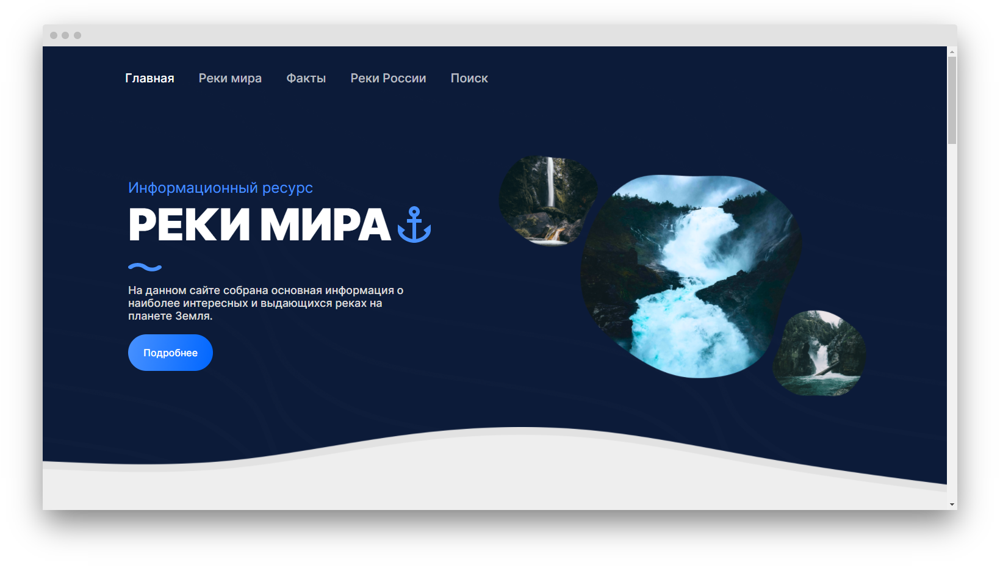

# Курсовая работа «Реки Мира»
- По предмету `Разработка Клиентских Частей Интернет Ресурсов`
- На тему `«Реки Мира»`
- Автор `Дмитрий Черненький`
- Группа `ИКБО-16-19`
 

### [Демонстрация проекта на GitHub Pages](https://dmitriy886.github.io/HTML-PROJECT/)

**Применены технологии**
 
1. `HTML5`
2. `CSS3`
3. `SCSS`
4. `JavaScript`
